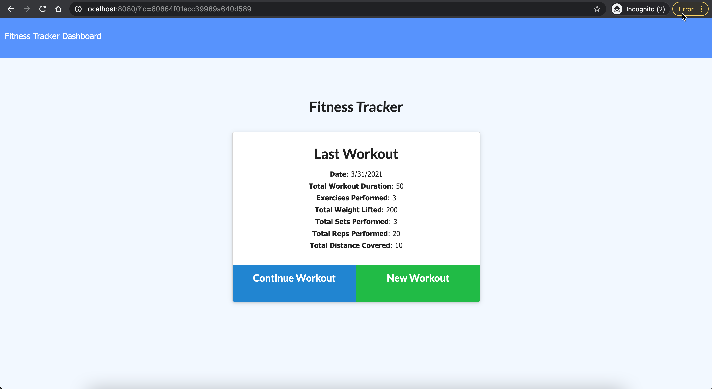
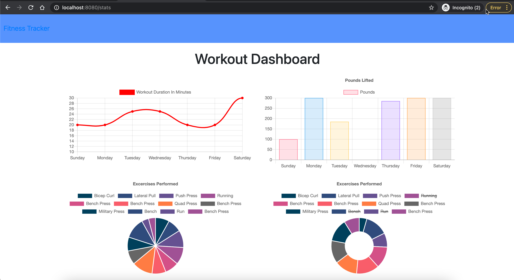
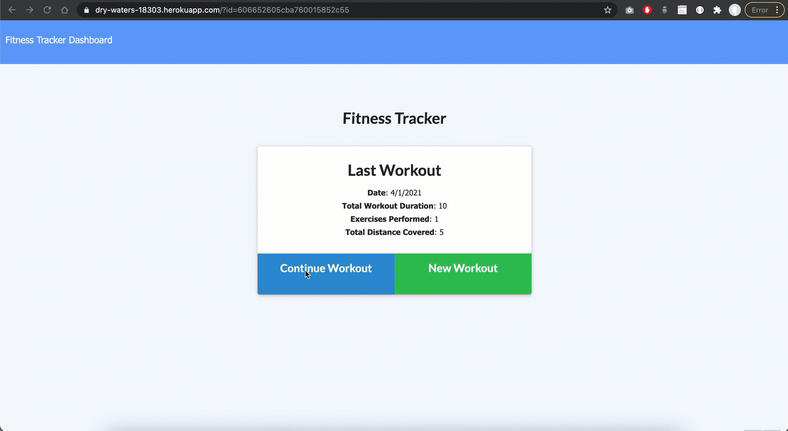

# fitness-tracker
## Description 
   
Fitness Tracker app enables users to view create and track daily workouts. This allows users to log multiple exercises in a workout on a given day. This also allows users track the name, type, weight, sets, reps, and duration of exercise. If the exercise is a cardio exercise, users should be able to track the distance traveled.


 
 

## Heroku Deploymet:
This app is also deployed in heroku. Please click this link to view the  [Deployed App](https://dry-waters-18303.herokuapp.com/) in heroku.

  ## Table of Contents
  * [Technologies Used](#technologies)
  * [Installation](#installation)
  * [Usage](#usage)
  * [Contributing](#contributing)
  * [Tests](#tests)
  * [License](#license)
  
  ## Technologies
 HTML, CSS, JavaScript, Node, Express, Mongo, Mongoose
  
  ## Installation
    
Clone the repository to your local development environment.

```
git clone https://github.com/binayaluitel2/fitness-tracker
```
Navigate to the fitness-tracker folder using the command prompt.

Run `npm install` to install all dependencies.

Navigate to the config folder and update connection.js file with correct password. 

Then, run `node server.js` to start the application. 

Once the application is start please follow the video demo below to complete and track your daily workout.

  ## Usage 
    
  
  
  ## Contributing
  
  Binaya Luitel
  
  ## Tests  
  
 None
  
  ## License
  
  MIT License
  
